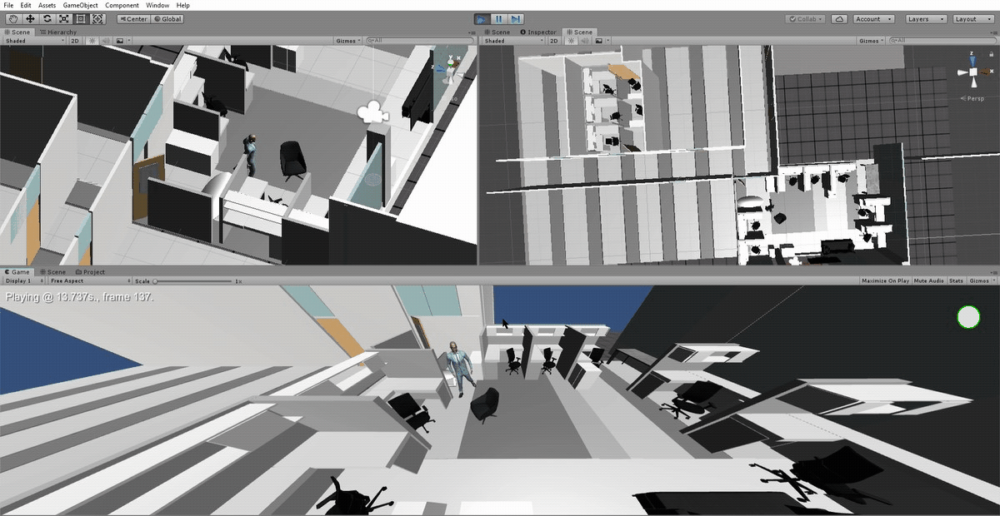

# Multiple Kinect 4 Azure Visual IoT Devices
# in Use in Some of our Labs with Unity Integration
# and Skeleton Tracking

Azure for Kinect and Unity Integration Files
 
Usage of four Kinect v4 Azure depth sensors and a modified version of the demonstration
by RF Solutions Inc. with our own virtual environments to track multiple people and
map their motion into multiple avatars in our environments.

The virtual environments were created in Unity 2018.4.11f1.

Below are a couple of brief examples of the tracking and avatar motion.
These include the virtual environments in various labs and hallway in our building.

### Virtual Labs Enviroment and Unity Demo

### Virtual Labs Enviroment and Unity Demo 2

### Example of Another Lab Environment Developed in Unity 2019.4.13

