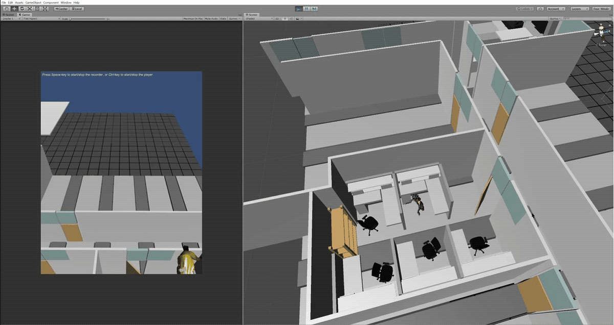

# Azure4Kinect_Base_4AILab
 Azure for Kinect and Unity Integration Files
 
This is a demonstration of how we used one of the Azure Kinect examples developed by RF Solutions Inc.
We tracked multiple skeletons (human subjects) and ported their motion live into a virtual environment created in Unity 2018.4.11f1.
The human subjects were represented as avatars in the virtual environment.  
Below is a brief sample of the tracking and avatar motion.

